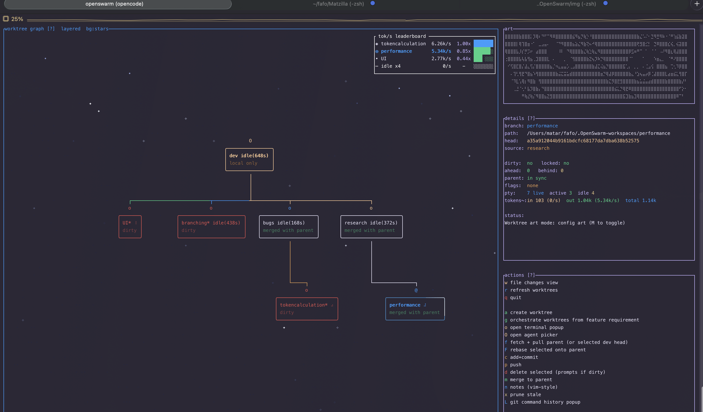

# OpenSwarm

An interactive TUI for managing worktrees and parallel AI agents.



Run multiple AI agents in parallel, each in its own isolated Git worktree, managed from a single visual interface. No terminal juggling, no `cd` between directories, no lost context.

## The problem

AI agents work best with their own working directory. When you're running 5+ agents across different branches, you end up juggling terminals, manually creating worktrees, tracking which agent is where, and copy-pasting git commands across tabs.

OpenSwarm puts everything on one screen.

## Features

- **Worktree graph** -- visual, interactive graph with status badges, ahead/behind counts, and live agent activity
- **Embedded terminals** -- launch shells and agents in PTY sessions inside the TUI; sessions persist in the background
- **Inline diffs** -- file staging with method-level diff analysis
- **One-key git** -- create, commit, push, merge, rebase, and delete worktrees without leaving the TUI
- **Feature orchestration** -- describe a feature, review per-worktree prompts, execute across multiple branches
- **Agent conflict solver** -- merges that conflict can be handed off to an agent with a prefilled resolution prompt
- **Token telemetry** -- live tok/s leaderboard across all running agents

## Quick start

```bash
cargo install --path . --bin openswarm --force
openswarm
```

Then: `a` to create a worktree, `O` to launch an agent, `c` to commit, `p` to push, `m` to merge.

## Requirements

- Rust toolchain (stable)
- Git on PATH

## Documentation

Full docs, keybindings reference, configuration, and workflows: [matars.github.io/OpenSwarm](https://matars.github.io/OpenSwarm/)

## Status

Actively evolving. Feedback and bug reports welcome.
